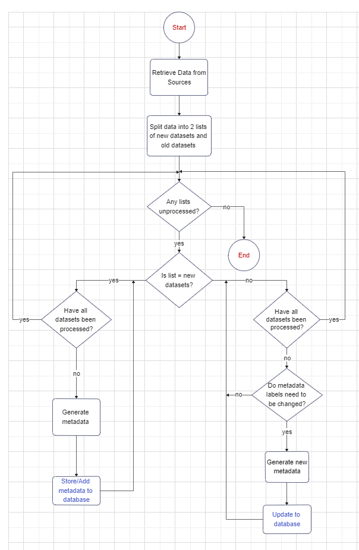

# Project Process

## **Program Function**

- View datasets on API
- Extract data
- Generate metadata
- Store metadata
- Update metadata labels
- Add metadata regularly
- Allow clients to query datasets
  
## **Flow Chart**

 

## **Design Requirements**

## Extract Data

- Using APIs on databases such as OpenML, select datasets. 
- Download datasets one by one using a for loop where downloading datasets is the first action of a cycle.
- After all datasets have been used, end the for loop.

## Generate metadata

- **Input**: Dataset which does not have metadata in the database
- Store metadata information about each dataset in a dictionary of key-value pairs
- The keys are:  
Name   
Task Type  
URL  
Description  
Number of Rows  
Number of Features 
Number of Classes  
Date of when data was taken  
Number of Missing Values  
Target Attibute  
Sector
- For every key, iterate through the dataset and retrieve the value if attainable and add it to the dictionary
- Delete dataset when metadata generation is complete

## Store metadata

- **Input**: Metadata about one dataset
- Store metadata in MongoDB

We are using MongoDB to store metadata. This is because there are many advantages to using it compared to its alternatives: 

- **Flexibility**. MongoDB is a key-value database which stores data in documents which have a flexible schema. This is needed when new values (which might have different data types) are added regularly. If a field is not in the metadata, then not putting the key-value pair into the database for that entry saves a lot of time.
  
  MongoDB's flexibility is far superior to SQL Relational databases. In a relational database, there is a fixed schema which enforces the user to enter value for each metadata label for all of the datasets. Also, the datatype must be fixed for all the entries in a column which will be tricky to ensure

- **Small storage space required**. In terms of storage space, not much storage space is required. For every dataset, the metadata storage is shown:   
Name (~15 bytes)    
Task Type  (~20bytes)  
URL  (~30 bytes)  
Description  ( ~100 bytes)  
Number of Rows  (~15 bytes)  
Number of Features (~15 bytes)  
Number of Classes  (~15 bytes)  
Date of when data was taken  (~10 bytes)  
Number of Missing Values  (~15 bytes)  
Target Attibute  (~20 bytes)  
Sector (~15 bytes)  

Total - 270 bytes  

So if there are a million datasets which are extracted, then the database total storage will be around 270MB. This is not a lot of data therefore and so MongoDB will run effectively. 

- **Sufficient querying options**. There are many other key-value databases as well. However popular options such as Redis or DynamoDB have limited querying options. MongoDB has a rich querying language which is almost as powerful as SQL.

## Update Metadata Labels

- Check if the list of metadata labels that is used for metadata generation has been changed. Updating occurs if there is a change.
- **Input**: Dataset which already has metadata in database
- Generate new metadata for the new keys
- Add new metadata into pre-existing metadata
- Delete any metadata which has a key that is no longer in the list of metadata labels.

## Allow clients to query

Create a function which does the following:
- Clients are able to query the database through filtering the metadata labels
- The URL of the datasets selected should be outputted 
