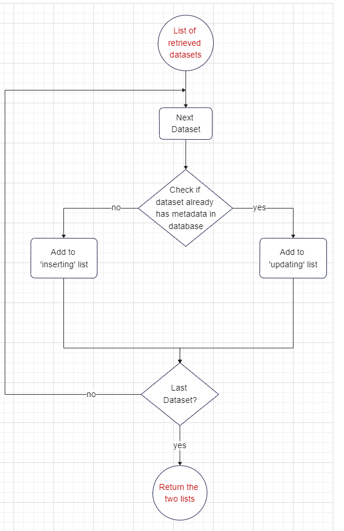

# Project Process

## **Program Function**

- Retrieve data from sources
- Split data into two lists: a list of new datasets and a list of datasets which have been looked at before.
- Generate metadata
- Store metadata
- Update metadata labels
- Add metadata regularly
- Allow client to query datasets
  
## **Flow Chart**

 

## **Design Requirements**

## Retrieve data from sources

- **Input**: when program is started
- View and select datasets on databases such as OpenML using APIs
- **Output**: List of all datasets  

## Split Data into two lists

- **Input**: list of datasets
- **Output**: 2 lists: one list which contains new datasets - datsets which are going to be inserted into the database, and another list which contains datasets which already have metadata in the database. 

 

 

## Generate metadata

- **Input**: Dataset
- Download dataset
- Store metadata information about each dataset in a dictionary of key-value pairs
- The keys are:  
Name   
Task Type  
URL  
Description  
Number of Rows  
Number of Features 
Number of Classes  
Date of when data was taken  
Number of Missing Values  
Target Attibute  
Sector
- For every key, iterate through the dataset and retrieve the value if attainable and add it to the dictionary
- Delete dataset when metadata generation is complete

## Store metadata

- **Input**: Metadata about one dataset
- Store metadata in MongoDB
- **Output**: Return progress status 

We are using MongoDB to store metadata. This is because there are many advantages to using it compared to its alternatives: 

- **Flexibility**. MongoDB is a key-value database which stores data in documents which have a flexible schema. This is needed when new values (which might have different data types) are added regularly. If a field is not in the metadata, then not putting the key-value pair into the database for that entry saves a lot of time.
  
  MongoDB's flexibility is far superior to SQL Relational databases. In a relational database, there is a fixed schema which enforces the user to enter value for each metadata label for all of the datasets. Also, the datatype must be fixed for all the entries in a column which will be tricky to ensure

- **Small storage space required**. In terms of storage space, not much storage space is required. For every dataset, the metadata storage is shown:   
Name (~15 bytes)    
Task Type  (~20bytes)  
URL  (~30 bytes)  
Description  ( ~100 bytes)  
Number of Rows  (~15 bytes)  
Number of Features (~15 bytes)  
Number of Classes  (~15 bytes)  
Date of when data was taken  (~10 bytes)  
Number of Missing Values  (~15 bytes)  
Target Attibute  (~20 bytes)  
Sector (~15 bytes)  

Total - 270 bytes  

So if there are a million datasets which are extracted, then the database total storage will be less than 300MB (also MongoDB stores compressed files). This is very little data therefore and so MongoDB will run effectively. (We don't need to consider storage space when considering what database to use)

- **Sufficient querying options**. There are many other key-value databases as well. However popular options such as Redis or DynamoDB have limited querying options. MongoDB has a rich querying language which is almost as powerful as SQL.

## Update Metadata Labels

- **Input**: Dataset which already has metadata in database
- - Check if the list of metadata labels that is used for metadata generation has been changed. Updating occurs if there is a change.
- Generate new metadata for the new keys
- Add new metadata into pre-existing metadata
- Delete any metadata which has a key that is no longer in the list of metadata labels.
- **Output**: Return progress status

## Allow clients to query

Create a function which does the following:

- **Input**: Client queries and filters
- **Output**: Metadata of datasets which fulfill the filters.
